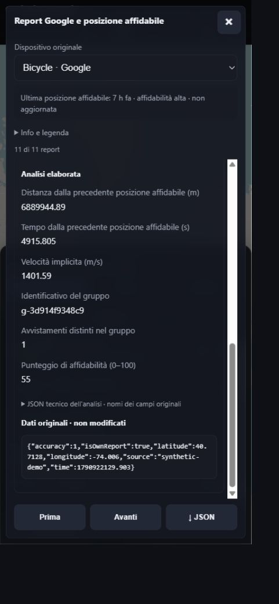
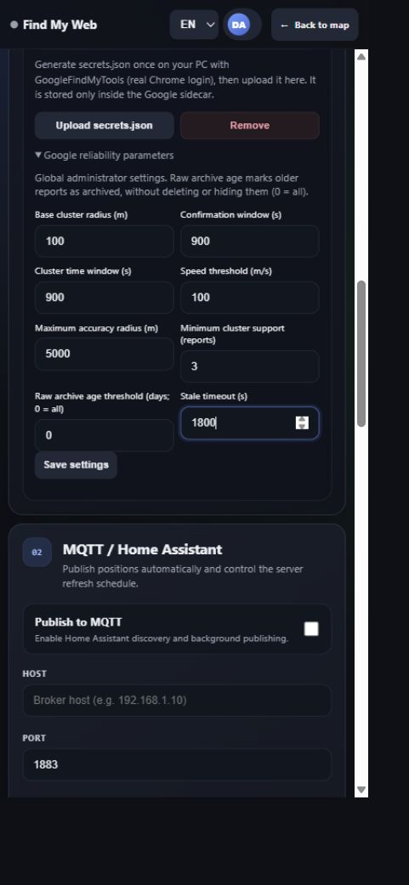

# Find My Hub — illustrated user guide

[Italiano](USER_GUIDE.it.md) · [Feature gallery](screenshots/README.md)

## Why this project exists

An object can have an Apple tracker, a Google tracker, or a programmable BLE
board that advertises both identities. Find My Hub brings their reports into
one self-hosted map and a durable local history, rather than making you switch
between provider tools. Separate accounts let a household or small team use
the same installation without giving every user access to everyone's trackers.

Use it only for objects, trackers and accounts you own or are authorized to
manage. This is an unofficial project, not Apple/Google certification, a new
finding network, a GPS receiver, or a guaranteed real-time tracking service.
Reports depend on contributing phones, upstream policies and network coverage.


## How information reaches the map

```text
Your BLE tracker → nearby contributing phones → Apple / Google finding network
                                              ↓
                       macless-haystack / Google Find Hub sidecar
                                              ↓ HTTP
                         Find My Hub → local SQLite event history → browser map
                                     ↘ MQTT / Home Assistant (optional)
                                     ↘ existing Traccar Server (optional)
```

The tracker normally advertises; it does not upload directly to this server.
The providers authenticate with their respective accounts and fetch reports.
The web backend polls them in the background, normalizes and deduplicates events,
then stores them locally. Closing the browser does not stop polling. Moving a
map point, changing a filter or creating a unified view does not modify the
physical tracker. Historical coordinates are sightings, not a continuous route.

There are two supported installation models: the all-in-one Compose/store bundle
with separate web, Apple, Google and Anisette containers; or just the web engine
connected to existing standard providers. MQTT and Traccar are never required.
The Traccar-named Google sidecar is **not** the optional Traccar map server.

## 1. Install and sign in

Use the catalog's Compose file or a supported store. Open `http://HOST:8125`,
create the first administrator, then configure providers from **Setup**. The
web interface requires sign-in; provider API tokens are separately optional.
Keep unprotected provider ports inside a trusted LAN/VPN. Use HTTPS when exposing
the interface beyond localhost or your trusted network.


The top language selector switches English/Italian and remembers the choice.
On mobile, the notepad button opens the device sheet; its handle expands it and
the chevron closes it. Selecting a device keeps its marker in the visible map
area above the controls. Location permission for **Show my position** is optional.

## 2. Connect Apple and Google (administrator)

Only the administrator can open **Setup**, edit provider addresses and manage
infrastructure. Use addresses reachable **from the web container**: Compose
service names work only on a shared Docker network; `localhost` means that
container, not your NAS. A published LAN address/port is an alternative.


- Apple reports: macless-haystack HTTP endpoint, normally port `6176`.
  The optional setup controller on `6177` bridges its SMS 2FA flow. Read the
  installation README's account prerequisites before onboarding. Reauthentication
  removes the provider session, not devices or saved web history.
- Google reports: Google Find Hub sidecar, normally port `5500`.
  Generate `Auth/secrets.json` with the upstream desktop login flow, then upload
  it through the optional controller on `5501`. A Google API token protects the
  local HTTP service; it is **not** the Google account credential.
- **Save provider connections**, then **Test connections**. With standard
  external providers, optional onboarding/registration controls may be unavailable
  while normal device and position retrieval still works.

Google custom identities need renewed timestamp/EID mappings: initial upstream
registration preloads about **96 hours**. The packaged sidecar refreshes at
startup and approximately every 12 hours, with jitter, a shared lock and retry.
`request_device_list()` alone does not renew mappings. Sidecar diagnostics and
the manual refresh endpoint are documented in the installation README.
Official non-custom trackers are excluded; renewal does not generate a new identity.

## 3. Add or generate a tracker

Expand **Add a device** to import the Apple private key, the Google canonical ID
and advertisement EID, or both. One logical device can contain both identities.
An administrator can choose its owner; ordinary users add devices only to their
own account. The server verifies Apple private/advertisement consistency and
prevents assigning duplicate identities to different devices.


Alternatively expand **Create new tracker identity**, choose Apple, Google or
both, and inspect/copy the generated values first. A web device is created only
when you explicitly choose **Create device** afterward. Google generation
registers an upstream Google identity even if you do not subsequently save it
as a web device; keep its generated values safe.

Apple uses a 28-byte P-224 private key (Base64) to decrypt reports and a matching
28-byte advertisement value for firmware. Google uses its canonical ID plus a
20-byte EID (40 hex characters) for advertising. These are not interchangeable.
After creation, **Generate firmware** offers ESP32/Nordic links with the identity
prefilled. The same links are available in each device's settings.

## 4. Map, source filters and position details

**All / Apple / Google** selects the source. **Latest** shows recent positions;
**History** shows the available historical points and per-source paths. Select a
device/marker to navigate with older/newer buttons or the slider. Position details
include source, sighting timestamp, received time, coordinates and accuracy when
available. Copy coordinates or open Google Maps/Apple Maps without editing data.


### Time range (1.1.15)

In **History → Period**, choose all available, last 24 hours, 7 days, 30 days, or
**Custom**. Enter local start/end date and time and press **Apply period**.
Start/end are inclusive; the entire final selected minute is included. Rolling
presets move with the current time. Invalid dates leave the applied filter intact.


The choice is remembered per signed-in account in the current browser, not
synchronized to other browsers. It filters markers, paths, counts and navigation,
including unified views and individual members. **Latest** ignores this filter.
A period without points explicitly says so: it does not mean the device has
never been received. Filtering does not delete data or change MQTT/Traccar output.
“All available” means locally retained history, not unlimited upstream history.

## 5. Device settings, visibility and order

Open **⚙** to rename, change color, inspect provider fields, choose MQTT sources,
open firmware tools, manage identities or delete the device. Key fields stay
locked until the pencil is pressed. Only administrators can assign owners.
Deletion and key rotation are different actions; read their confirmation text.


The eye hides a device from the map without deleting it. **Show hidden** controls
whether hidden rows appear and is remembered per account/browser. **Edit order**
explicitly enables reordering, preventing accidental mobile drags; use one-step
up/down controls or a drag handle, then save. Hidden rows are included while editing.


## 6. Reversible unified views

Open **⚙ → Unified view**, select at least two devices from the same account and
save. There is no two-device limit. The group has a letter badge (A, B, …), shows
the newest applicable Apple/Google positions and stays persistent across restarts.
It is a display construct: keys, physical devices and stored histories stay separate.


Tap a member to view only its history; its **⚙** opens the full original-device
settings, including firmware, identity and owner actions. Return to unified
history with its selector. Edit membership to add/remove members. **Separate
devices** removes the visual group only and restores original rows unchanged.
When enabled, MQTT and Traccar can also expose an additional group entity whose
position is the newest eligible member event, based on sighting timestamp.

## 7. Rotate an existing identity deliberately

In original-device **Advertising identity**, choose the provider(s) to replace.
Generate or supply replacement values, review them, and complete the explicit
confirmation. This is not triggered by an ordinary map click. Apple replacement
must use the matching private key, advertisement and derived query hash; Google
uses its own registration/identity flow. A secondary archive can retain prior
identities when requested; it contains sensitive keys, not an automatic rollback.


**Reflash the physical tracker with the new advertisement values.** Updating
only the web device cannot change BLE packets. Rotating does not rewrite existing
historical points. Removing an old local identity does not revoke credentials or
automatically unregister the tracker from Apple's/Google's account.

## 8. Multi-user administration

Open the account selector below the list and choose **Users**. Administrators
create accounts, change roles, deactivate/delete accounts and reset passwords.
The last active administrator cannot be removed. When deleting a user, devices
are reassigned rather than abandoned. Ordinary users see only their own devices,
can generate identities and manage their password through the account button.


The administrator can view all accounts or one account and assign device ownership
from settings. Unified members must remain in the same account. Server-side access
checks protect history and identity APIs, not just the visibility of UI buttons.

## 9. Background polling, MQTT and Home Assistant

In **Setup → MQTT / Home Assistant**, choose the broker, port, optional credentials
and base topic. Save, test, and inspect delivery/queue status. The same section
sets automatic polling frequency and provider-request history days. Server polling
continues with MQTT disabled and with the web page closed.


MQTT publishes normalized events and Home Assistant `device_tracker` discovery.
Per-device toggles choose participating sources. Unified views can publish an
additional newest-position entity. Temporary delivery errors use a retry queue;
the broker is not a dependency of the map. Map history filters never limit exports.

## 10. Optional Traccar map

**Setup → Traccar map** can connect to a standard existing Traccar Server using
its web/API URL, API token or account credentials, and OsmAnd receiver URL.
Choose original devices, unified views, or both; save, test and synchronize.
Find My Hub creates/manages its corresponding entities and forwards newest positions.


It is disabled by default. Disabling it stops Traccar requests; providers, accounts,
local history, the web map and MQTT remain independent. It does not install a
Traccar server. Inspect status/queue before assuming a missing entity is a BLE fault.

## 11. Export, full backup and migration

**Import / Export tags (JSON)** is for selected device identities and settings,
not complete history or user databases. Keep exported private keys confidential.
Administrator **Download complete web backup** includes accounts, SQLite history,
identities/archives, groups and saved settings, checksums and bilingual restore
instructions. It does **not** include the providers' separate login volumes.


Back up Apple/Google login volumes separately. Restore into a stopped compatible
installation following `RESTORE.txt`; do not overwrite a live database. The legacy
single-password/account and device data migrate automatically; updates normally
preserve existing volumes, identities and history. Retention cleanup is separate
from the display filter (default local retention: 21 days).

## 12. Program Nordic or ESP32 / reuse your existing firmware

From a device's **Generate firmware** choose Nordic or ESP32. Confirm the exact
chip/board, one or both advertisement values, interval, TX power, and static or
optional LIS3DH/LIS2DH/LIS2DH12 motion mode. Nordic also offers RC/external LF
clock selection and wiring guidance; use an external 32.768 kHz crystal only
when the board actually has one. A marking `32.000 MHz` is the radio HF clock,
not proof of a 32.768 kHz LF crystal. Automatic mode follows the board profile.


Prepare locally, review the summary, then connect the programmer/serial device
or download the complete portable ZIP. Browser flashing requires supported desktop
Chrome/Edge on HTTPS or localhost. Nordic uses CMSIS-DAP/DAPLink; ESP32 uses
WebSerial and may need the documented BOOT/RESET sequence. ZIPs contain your
personal advertising values: do not upload them to public repositories.


To add advertising to an existing Arduino/PlatformIO project, use the ESP32 page's
**Download optimized configured library** rather than replacing your whole firmware.
The ZIP includes the configured example, bilingual integration guides and an
optional space-optimized profile. Read the ZIP's instructions and merge only
options compatible with your project's other BLE needs.


Reference library: [FindMyAdv](https://github.com/Mattboxx/Find_My_adv_ESP_library).
Supported web assets include ESP32/C3/S3/C6 and Nordic 52810/52832/52833/52840;
nRF54L15 has its own board/transport limitations explained by the flasher. A
successful compile/flash is not a guarantee of every board revision's pin mapping.
Radioland LED/button hardware validation remains pending; 1.1.15 changes no firmware.

## Google reliable locations (1.1.16)

Google reports are observations, not automatically the current position.
Find My Hub now archives every original Google report before validation and
computes a separate reliable location using consensus, clustering and motion
plausibility. An isolated teleport stays pending; confirmed relocation can
replace an older anchor. HIGH/MEDIUM/LOW and STALE describe the derived result,
not a guarantee that it is correct. Apple behavior and tracker keys do not change.

Open **Google data · developer tools** at the bottom of the device panel to
choose **Optimized / Raw / Both** or open **Reports**. The collapsed controls
keep normal device operations prominent. The original-device archive includes
invalid and duplicate reports, with reasons and RAW/DERIVED details. Pages are
200 reports; use Next page or download JSON. Raw/Both draws loaded pages only,
not the entire archive, and reloads first pages automatically after sign-in.

In 1.1.19, **Info and legend** contains optional explanations, closed initially.
Expand a report to read its reason and larger fields, stacked vertically on mobile.
The list scrolls independently while First, Next and JSON download stay accessible.
Use the close button or Escape to return to the map; keyboard focus is restored.
Switching device or page clears the old content and disables export while loading.
Failed requests show **Retry**; late replies cannot replace the selected device.



Administrator parameters are under **Setup → Provider connections → Google
account → Google reliability parameters**, not in the Reports dialog. The raw
age threshold marks older receipts as archived but never deletes or hides them.
Monitor disk usage and keep backups private; the append-only archive grows.
Available old normalized Google history migrates automatically, but fields or
reports discarded by older versions cannot be reconstructed.

MQTT/Home Assistant current states and the hub's optional Traccar exporter use
the reliable Google location; normalized event topics still carry observations.
For defaults, algorithm limits, API pagination and migration details, read
[Google raw and reliable location](GOOGLE_RELIABLE_LOCATION.md).



## 13. Update safely and troubleshoot by layer

Use the store update or pull the versioned Compose images and recreate services,
keeping existing data volumes. `1.1.19` is reproducible; `latest` follows the
latest released image. The store version, image tags and every architecture
manifest must agree. Do not reinstall/delete data simply because a store has an
outdated cache. Take backups before changing your installation.

Check **web `/healthz` → container DNS/TCP → provider account/API → registered
identity/EID renewal → actual BLE packet → new sighting** in that order. A live
container icon does not prove its web process is healthy. A successful renewal
does not prove a phone has contributed a new location. Home-area suppression and
crowdsourcing eligibility can also affect sightings; network response times are
not guaranteed. Find My Hub does not provide universal remote buzzer/ringing support.

## Privacy and publication

All gallery screenshots contain synthetic data from an isolated disposable
installation. Provider connectivity is intentionally not configured in the demo;
“unreachable/disabled” states are genuine, not claimed successful live tests.
No real provider session, password, private key, personal tracker ID or user
location was used. Never publish runtime `data/`, provider credentials, backups,
configured firmware/library ZIPs, or your own unredacted screenshots.

The web source repository remains private by choice. The installation catalog,
documentation, synthetic screenshots and previously public installable container
packages stay public so stores can install without GitHub credentials. This does
not make a Docker image a confidentiality boundary: runnable images contain app
code. Provider source/license obligations are documented in the release source offer.
