# Find My Hub — guida illustrata

[English](USER_GUIDE.en.md) · [Galleria delle funzioni](screenshots/README.md)

## Il senso del progetto

Un oggetto può avere un tracker Apple, un tracker Google oppure una scheda BLE
programmabile che trasmette entrambe le identità. Find My Hub raccoglie le loro
posizioni in una sola mappa self-hosted, conservando uno storico locale senza
dover passare continuamente tra strumenti diversi. Più account permettono a una
famiglia o a un piccolo gruppo di condividere il server mantenendo separati i
dispositivi. L'amministratore controlla utenti e collegamenti ai servizi.

È un progetto non ufficiale: non è certificato Apple/Google, non crea una nuova
rete di ricerca, non contiene un ricevitore GPS e non garantisce aggiornamenti
in tempo reale. Gli avvistamenti dipendono dai telefoni contribuenti, dalla rete
e dalle regole dei provider. Usalo solo per dispositivi, oggetti e account tuoi
o che sei autorizzato a gestire.

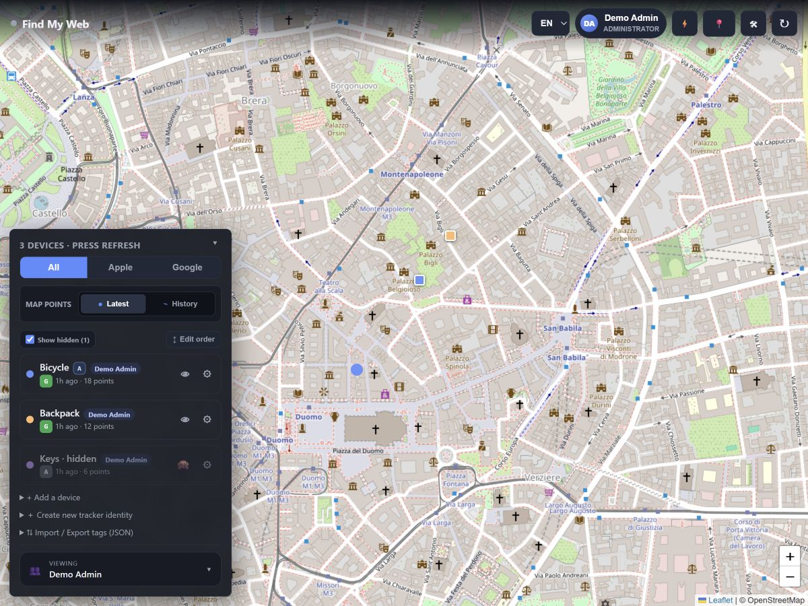

## Come funziona

```text
Tracker BLE → telefoni contribuenti vicini → rete Apple / Google
                                                 ↓
                           macless-haystack / sidecar Google Find Hub
                                                 ↓ HTTP
                            Find My Hub → storico SQLite locale → mappa web
                                        ↘ MQTT / Home Assistant (opzionale)
                                        ↘ Traccar Server esistente (opzionale)
```

Il tracker trasmette advertising, non invia direttamente al tuo server. I
provider accedono ai rispettivi account e recuperano i report. Il backend web
li interroga periodicamente, normalizza e deduplica le posizioni, poi le salva
localmente. Chiudere la pagina non interrompe il polling. Filtri, mappa e viste
unificate non cambiano il firmware. I punti sono avvistamenti, non una traiettoria
continua misurata dall'oggetto.

Puoi installare il bundle con web, Apple, Google e Anisette in container separati,
oppure soltanto il web collegandolo a provider standard già esistenti. MQTT e
Traccar sono sempre opzionali. Il sidecar Google del fork chiamato **traccar**
non è il **Traccar Server** usato dall'integrazione opzionale della mappa.

## 1. Installazione, accesso e lingua

Installa tramite Compose o uno store supportato e apri `http://HOST:8125`.
Al primo avvio crea l'amministratore e configura i provider in **Setup**.
La mappa richiede un account; i token delle API provider sono invece facoltativi
e distinti dal login web. Lasciare i provider senza token è accettabile solo
su una LAN/VPN fidata. Usa HTTPS per accessi fuori da localhost/rete fidata.

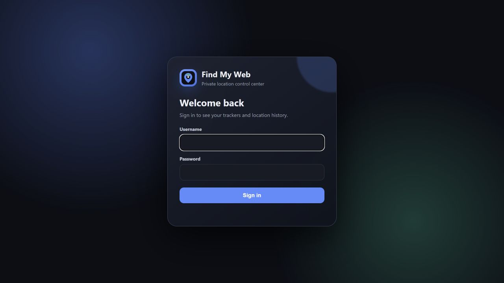

Il selettore EN/IT conserva la lingua nel browser. Da mobile il blocco note apre
la lista, la maniglia permette di espanderla e la freccia di richiuderla. Il
centraggio mantiene il punto nella mappa visibile sopra i controlli. Il permesso
di geolocalizzazione per **Mostra la mia posizione** è facoltativo.

## 2. Collegare i provider — solo amministratore

In **Setup** imposta indirizzi raggiungibili **dal container web**. I nomi dei
servizi Compose funzionano su una rete Docker condivisa; `localhost` indica il
container stesso, non il NAS. In alternativa usa IP LAN e porta pubblicata.

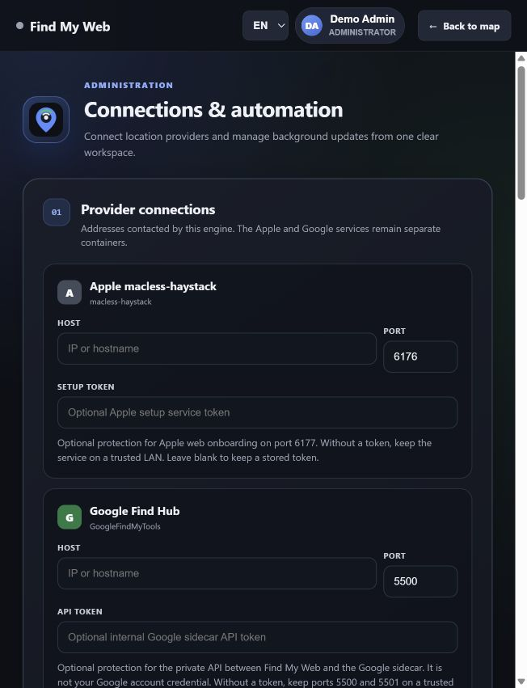

- Apple: endpoint macless-haystack HTTP, normalmente `6176`. Il controller
  opzionale `6177` consente l'autenticazione SMS 2FA dal web. Leggi i prerequisiti
  dell'account nel README d'installazione. Rimuovere la sessione Apple non elimina
  dispositivi o storico del web.
- Google: sidecar Find Hub, normalmente `5500`. Genera `Auth/secrets.json`
  con il login desktop upstream e caricalo tramite il controller opzionale `5501`.
  Il token dell'API protegge il servizio locale: **non è** una credenziale Google.
- Salva i collegamenti e usa **Verifica connessioni**. I provider esterni standard
  continuano a fornire dispositivi e posizioni anche se non supportano i controller
  di onboarding o la registrazione automatica dal web.

La registrazione Google custom precarica circa **96 ore** di associazioni
timestamp/EID. Il sidecar incluso le rinnova all'avvio e circa ogni 12 ore, con
jitter, lock condiviso e retry. Chiamare soltanto `request_device_list()` non le
rinnova. Diagnostica e comando manuale sono documentati nel README tecnico.
Il rinnovo esclude i tracker ufficiali non custom e non cambia l'identità.

## 3. Aggiungere dispositivi o generare identità

In **Aggiungi un dispositivo** importa private key Apple, ID canonico Google e
EID advertisement, oppure entrambe le identità. Un dispositivo logico può avere
Apple e Google. Gli utenti creano dispositivi nel proprio account; l'admin può
scegliere il proprietario. Il server verifica la coerenza delle chiavi Apple e
impedisce di assegnare la stessa identità a dispositivi differenti.

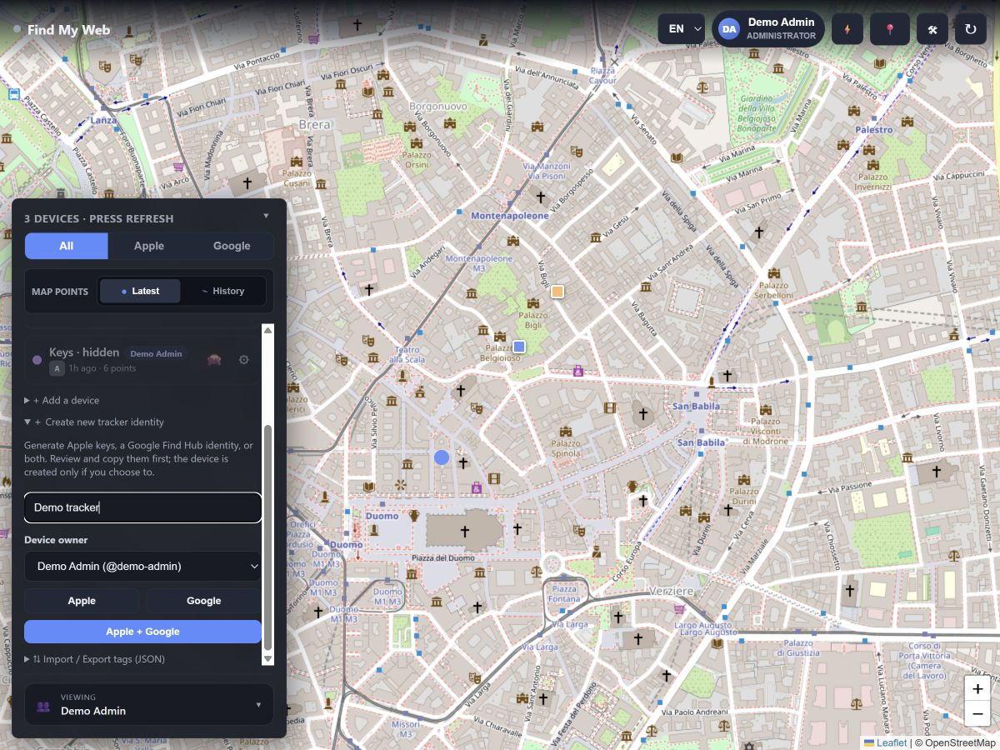

In **Crea nuova identità tracker** scegli Apple, Google o entrambi. Prima vengono
mostrate le chiavi: copiale e salvale; il dispositivo web nasce soltanto se premi
successivamente **Crea dispositivo**. La generazione Google registra già
un'identità nel provider/account Google anche se non salvi poi il dispositivo web.

Apple usa una private key P-224 di 28 byte Base64 per decifrare e un valore
advertisement corrispondente di 28 byte per il firmware. Google usa ID canonico
ed EID di 20 byte, cioè 40 caratteri esadecimali. Non sono intercambiabili.
Dopo la creazione appare **Genera firmware**, con collegamenti ESP32/Nordic
e valori già inseriti. La stessa funzione è nelle impostazioni del dispositivo.

## 4. Mappa, storico e intervalli di tempo

**All / Apple / Google** seleziona la sorgente. **Ultime** mostra posizioni recenti;
**Storico** mostra i punti disponibili e percorsi distinti per provider. Seleziona
un dispositivo o punto, usa precedente/successivo o lo slider. Sono disponibili
sorgente, data dell'avvistamento, data di ricezione, coordinate e accuratezza
quando presente, copia coordinate e apertura in Google Maps/Apple Maps.

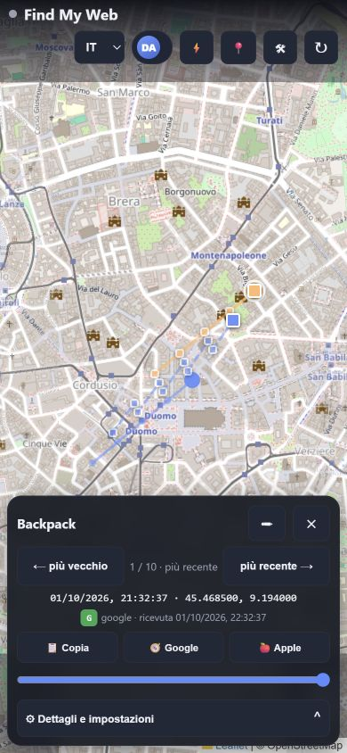

In **Storico → Periodo** scegli tutto il disponibile, ultime 24 ore, 7 giorni,
30 giorni oppure **Personalizzato**. Inserisci data e ora locali di inizio/fine
e premi **Applica periodo**. Gli estremi sono inclusi, compreso l'intero ultimo
minuto selezionato; gli intervalli rapidi scorrono rispetto all'ora corrente.
Date non valide lasciano intatto il filtro applicato.

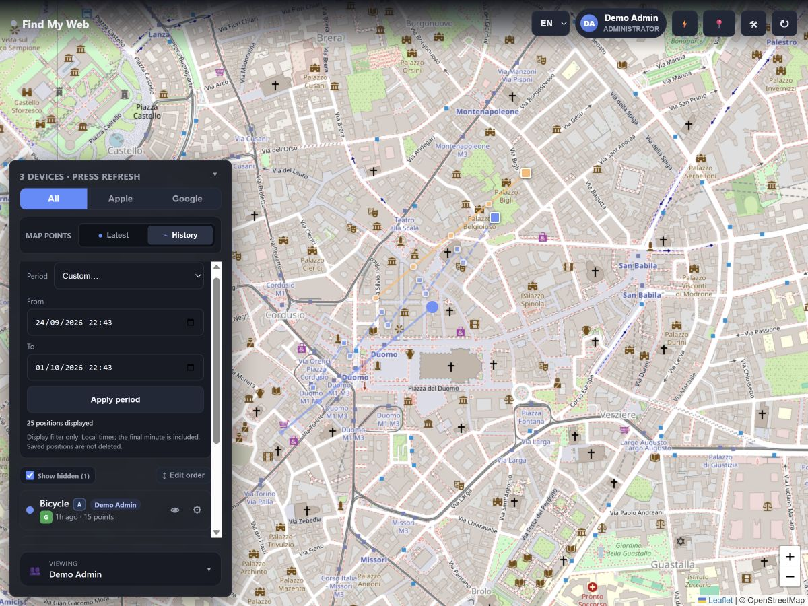

La scelta persiste per account nel browser corrente, non su tutti i browser.
Filtra punti, percorsi, conteggi e navigazione, anche per viste unificate e
membri. **Ultime** ignora il filtro. Un periodo vuoto è indicato esplicitamente
e non significa “mai ricevuto”. Non vengono cancellate posizioni e non cambiano
le uscite MQTT/Traccar. “Tutto” significa tutto lo storico locale conservato,
non uno storico illimitato recuperabile dalle reti Apple/Google.

## 5. Impostazioni, visibilità e ordine

Con **⚙** puoi rinominare, cambiare colore, consultare i dati provider, selezionare
sorgenti MQTT, aprire il flasher, gestire identità o eliminare il dispositivo.
I campi delle chiavi sono bloccati fino al clic sulla matita. Solo l'admin può
assegnare il proprietario. Eliminazione e sostituzione dell'identità sono azioni
diverse: leggi le rispettive conferme.

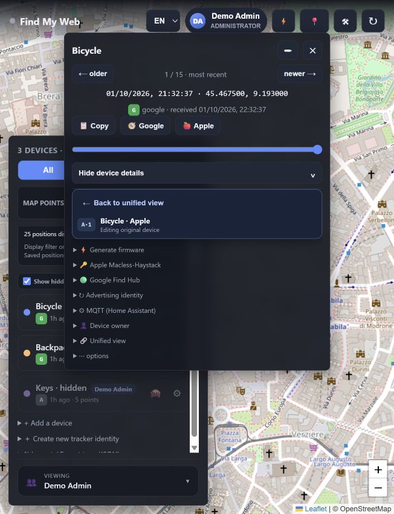

L'occhio nasconde dalla mappa senza eliminare. **Mostra nascosti** controlla
le righe della lista e conserva la preferenza per account/browser. **Modifica
ordine** attiva esplicitamente il riordino: frecce su/giù di una posizione oppure
maniglia di trascinamento, poi salvataggio. Durante la modifica appaiono anche
i nascosti, evitando omissioni e trascinamenti accidentali da mobile.

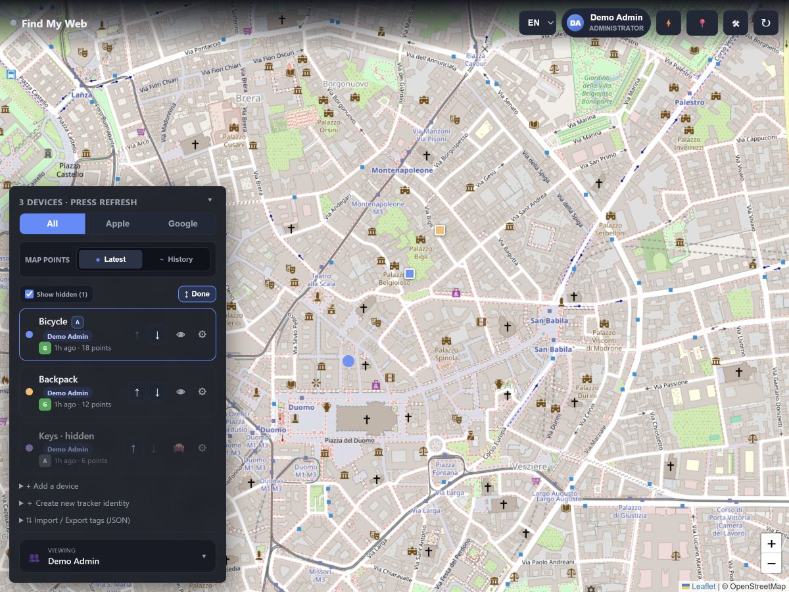

## 6. Viste unificate reversibili

In **⚙ → Vista unificata** seleziona almeno due dispositivi dello stesso account.
Puoi unirne anche più di due. La vista ha una lettera (A, B, …), mostra le posizioni
Apple/Google applicabili più recenti e rimane salvata dopo un riavvio. È solo un
costrutto di visualizzazione: identità, chiavi e storici non vengono fusi.

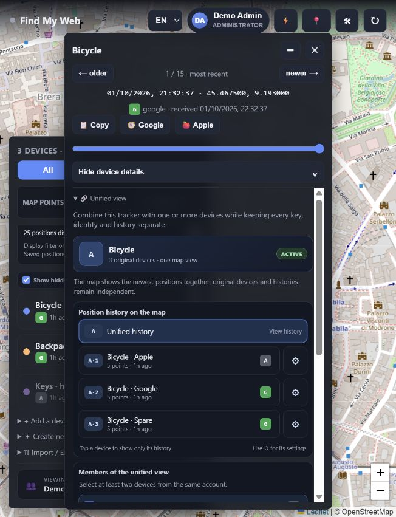

Un clic sul membro mostra soltanto la sua cronologia; la sua **⚙** apre tutte
le impostazioni originali, incluse identità, firmware e proprietario. Il selettore
permette di tornare alla cronologia unificata. Modifica i membri per aggiungerne
o rimuoverne. **Separa dispositivi** elimina solo il gruppo e ripristina le righe
originali senza cambiare le posizioni. Se abilitate, MQTT e Traccar espongono anche
un'entità del gruppo con l'evento ammissibile più recente per data di avvistamento.

## 7. Sostituire le chiavi di un dispositivo esistente

Nelle impostazioni originali apri **Identità advertising**, scegli i provider da
sostituire, genera o inserisci i nuovi valori, verifica e conferma esplicitamente.
Non si attiva con un normale clic sulla mappa. Per Apple private key, adv e hash
di interrogazione devono corrispondere; Google ha un proprio flusso di identità
e registrazione. Se richiesto, un archivio secondario conserva le precedenti
identità: contiene chiavi sensibili e non è un rollback automatico.

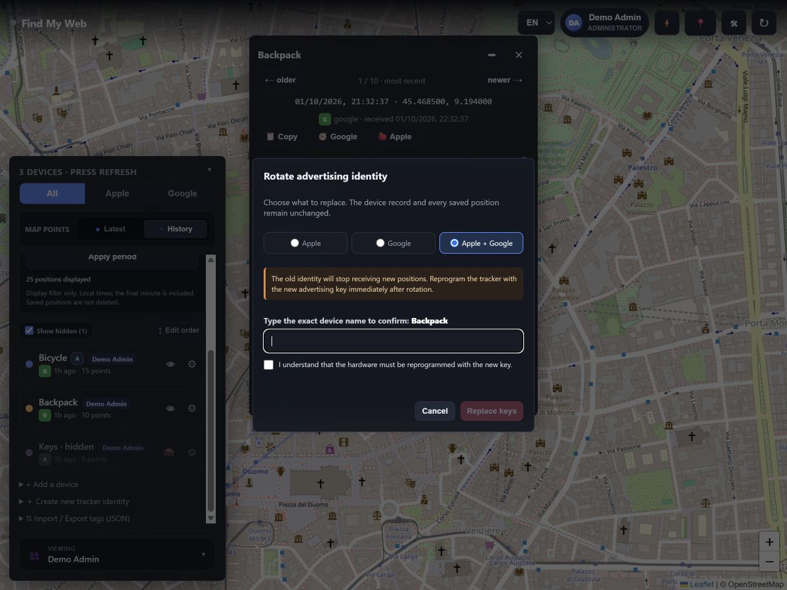

**Riprogramma il tracker fisico con le nuove adv.** Modificare il web non cambia
i pacchetti BLE. La sostituzione non riscrive le posizioni già salvate. Eliminare
un'identità dall'archivio locale non revoca credenziali e non disiscrive
automaticamente il tracker dall'account Apple/Google.

## 8. Account e ruoli

Nel selettore account sotto la lista, l'admin apre **Utenti**: crea account,
cambia ruoli, disattiva/elimina utenti e reimposta password. L'ultimo admin attivo
è protetto; eliminando un utente i dispositivi vengono riassegnati. Gli utenti
normali vedono solo i propri dispositivi, generano identità e cambiano la propria
password dal pulsante account.

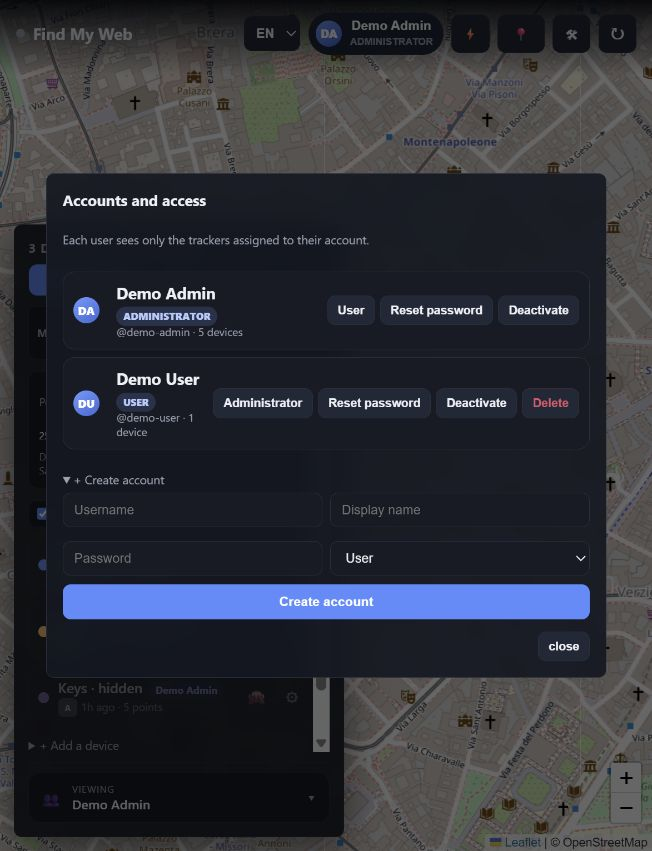

L'admin vede tutti o un account singolo e assegna la proprietà nelle impostazioni.
I membri unificati devono appartenere allo stesso account. I permessi sono
verificati dal server sulle API di storico/identità, non soltanto sui pulsanti.

## 9. Polling, MQTT e Home Assistant

In **Setup → MQTT / Home Assistant** imposta broker, porta, eventuali credenziali
e topic; salva, verifica e controlla stato/coda. Qui scegli anche frequenza
degli aggiornamenti e giorni di storico richiesti ai provider. Il polling server
funziona anche con MQTT disabilitato e pagina chiusa.

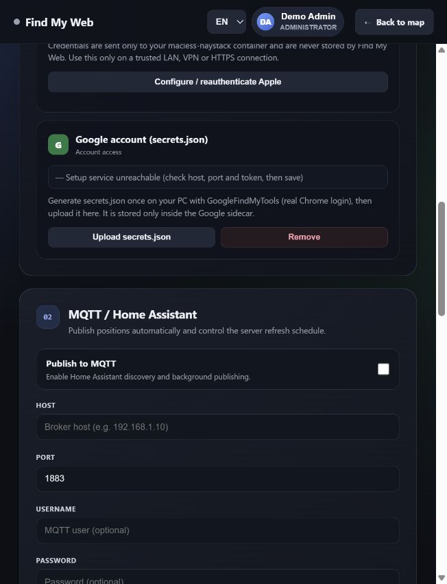

MQTT pubblica eventi normalizzati e discovery `device_tracker` per Home Assistant.
I dispositivi hanno selezione delle sorgenti; le viste unificate aggiungono
un'entità di ultima posizione. Errori temporanei usano una coda di retry. Il
broker non è necessario alla mappa; i filtri dello storico non limitano gli export.

## 10. Traccar opzionale

In **Setup → Mappa Traccar** collega un Traccar Server standard già esistente:
URL web/API, token oppure credenziali e URL ricevitore OsmAnd. Scegli dispositivi
originali, viste unificate o entrambi; salva, verifica e sincronizza. Find My Hub
gestisce le entità corrispondenti e inoltra le posizioni più recenti.

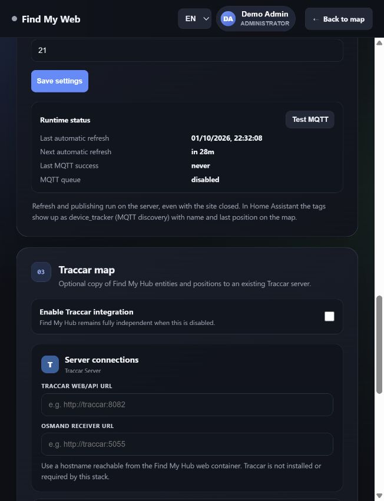

È disabilitata per default e non installa Traccar. Disabilitandola cessano le
richieste Traccar, ma provider, account, storico, mappa e MQTT restano indipendenti.
Controlla diagnostica e coda prima di attribuire un'entità mancante al firmware BLE.

## 11. Export, backup e migrazioni

**Importa / Esporta tag JSON** trasferisce identità e impostazioni selezionate,
non l'intero storico o gli account. Gli export contengono private key: tienili
riservati. Il **backup web completo** dell'admin comprende account, storico SQLite,
identità/archivi, gruppi e configurazioni salvate, checksum e istruzioni bilingui.
Non contiene i volumi di login separati dei provider.

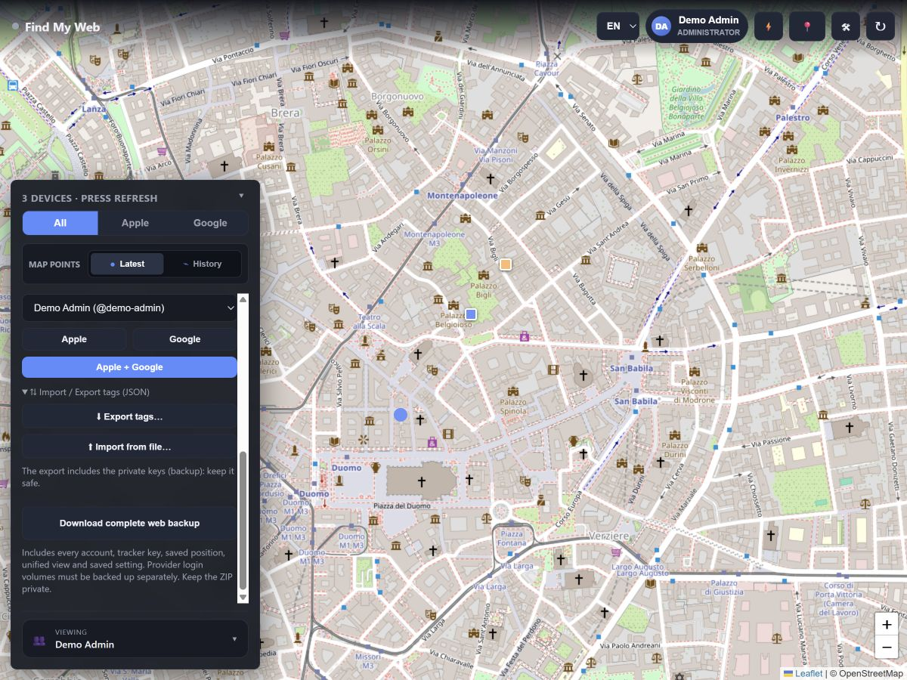

Salva separatamente i volumi Apple/Google. Ripristina su un'installazione compatibile
ferma seguendo `RESTORE.txt`, mai sopra un database in uso. Dati/account legacy
migrano automaticamente; normali aggiornamenti mantengono volumi, identità e
storico. La pulizia per retention è distinta dal filtro visivo: per default lo
storico locale è conservato per 21 giorni.

## 12. Flasher e libreria ESP32

Da **Genera firmware** scegli Nordic o ESP32 e verifica chip/scheda, una o entrambe
le adv, intervallo, potenza TX e modalità statica oppure dinamica con sensore
LIS3DH/LIS2DH/LIS2DH12 opzionale. Nordic include clock LF e istruzioni cablaggio.
Usa il quarzo esterno **32,768 kHz** solo se realmente presente: la scritta
**32.000 MHz** riguarda il clock radio HF, non prova la presenza del quarzo LF.
La modalità automatica segue il profilo della scheda, non una scansione dei pin.

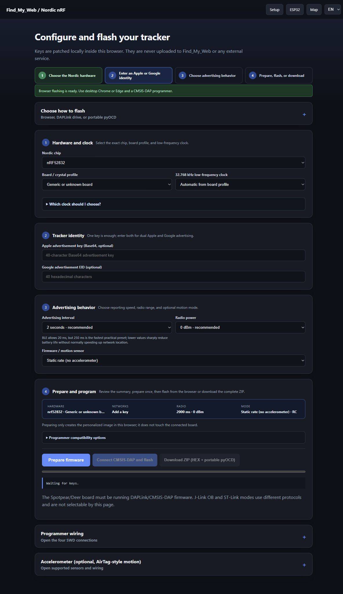

Prepara localmente e verifica il riepilogo, quindi collega programmatore/seriale
o scarica lo ZIP portatile completo. Il browser richiede Chrome/Edge desktop su
HTTPS/localhost: CMSIS-DAP/DAPLink per Nordic e WebSerial per ESP32. Su ESP32 può
servire la sequenza BOOT/RESET spiegata nella pagina. Gli ZIP personalizzati
contengono le tue adv: non pubblicarli.

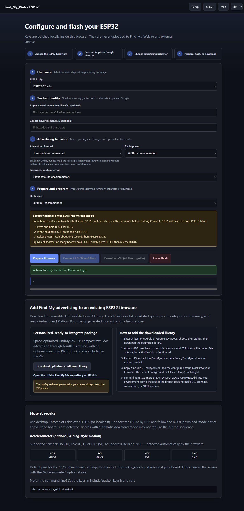

Per aggiungere advertising a un progetto Arduino/PlatformIO esistente, usa
**Scarica libreria ottimizzata configurata**: include esempio, istruzioni bilingui
e profilo opzionale per ridurre lo spazio. Integra soltanto le opzioni compatibili
con gli altri usi BLE del tuo programma, senza sostituire l'intero firmware.

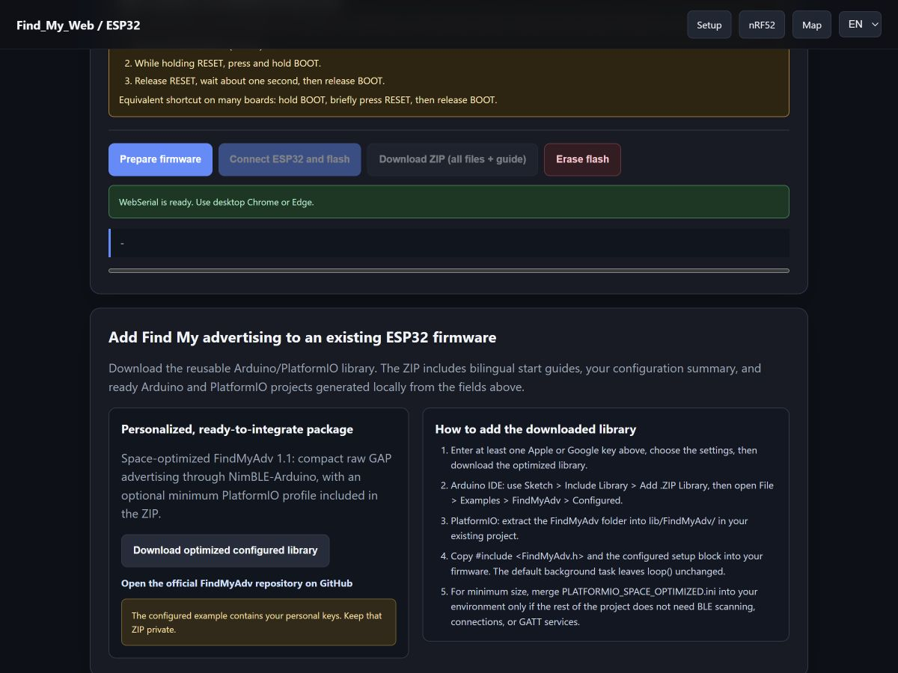

Repo di riferimento: [FindMyAdv](https://github.com/Mattboxx/Find_My_adv_ESP_library).
Asset web per ESP32/C3/S3/C6 e Nordic 52810/52832/52833/52840; nRF54L15 ha limiti
specifici di scheda/trasporto spiegati nel flasher. Una compilazione o flash
riusciti non certificano i pin di ogni revisione PCB. La verifica hardware del
pulsante/LED Radioland è ancora pendente; questa release non cambia firmware.

## 13. Aggiornamenti e diagnosi

Aggiorna dallo store oppure scarica le immagini Compose versionate e ricrea i
servizi mantenendo i volumi. `1.1.15` è riproducibile; `latest` segue l'ultima
release. Versione store, tag immagini e manifest delle architetture devono
coincidere. Non reinstallare/cancellare i dati per una cache dello store obsoleta.
Esegui backup prima di modificare l'installazione.

Controlla nell'ordine **`/healthz` web → DNS/TCP Docker → API/account provider →
identità e rinnovo EID → pacchetto BLE → nuovo avvistamento**. Un container acceso
non dimostra che la pagina risponda. Il rinnovo EID riuscito non garantisce un
report da un telefono; anche soppressione vicino Home e regole crowdsourced
influiscono. Non sono garantiti tempi di ricezione e non esiste supporto universale
al buzzer/ringing remoto in Find My Hub.

## Privacy delle immagini e dei pacchetti

Le immagini mostrano dati sintetici di un'installazione isolata e temporanea.
I provider demo sono intenzionalmente non configurati: stati “non raggiungibile”
o “disabilitato” sono reali, non prove inventate di servizi online. Non sono usate
sessioni, password, private key, ID tracker o posizioni personali. Non pubblicare
`data/`, credenziali provider, backup, ZIP firmware/libreria configurati o tue
schermate non anonimizzate.

Il sorgente web rimane privato per scelta. Catalogo d'installazione, guide,
schermate sintetiche e pacchetti container già pubblici restano accessibili
agli store senza login GitHub. Un'immagine Docker eseguibile contiene codice:
la privacy del repository non rende segreto il contenuto del container. Gli
obblighi di licenza/sorgenti dei provider sono documentati nell'offerta sorgenti.
